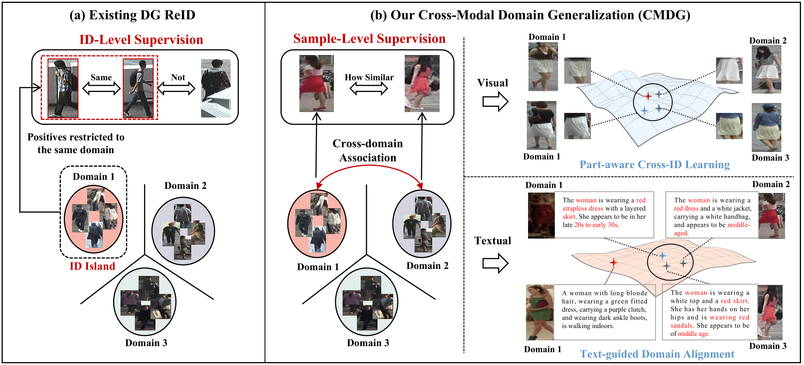
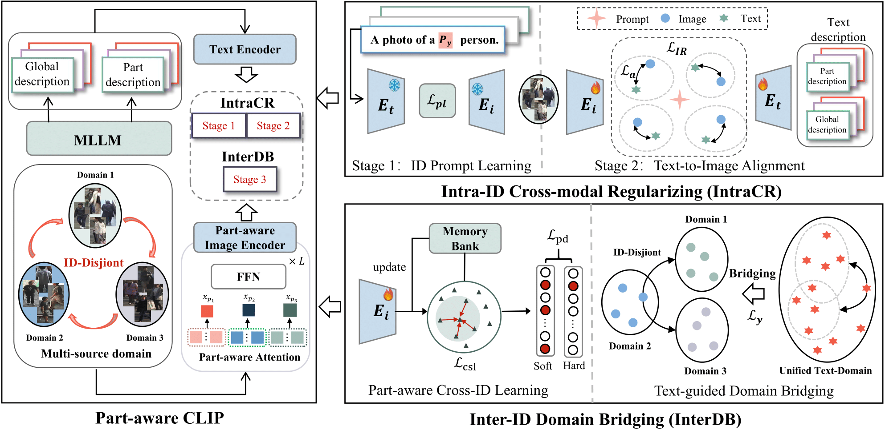

<div align="center">
<h1>Learning Across Identity Islands: Cross-Modal Domain Generalization Person ReID</h1>
<a href="https://huggingface.co/papers/2510.18632"></a>

**University of Electronic Science and Technology of China**; **Korea Advanced Institute of Science and Technology**

Hao Ni, Yijun Xue, Lianli Gao, Sunghoon Im, Heng Tao Shen, Jingkuan Song

</div>

## Overview


## Abstract

Domain generalizable person re-identification (DG ReID) aims to learn representations from multiple source domains that generalize to unseen target domains. Most existing ReID methods learn discriminative representations under ID-level supervision, encouraging samples of the same identity to be close while pushing samples of different identities apart. However, such hard supervision implicitly relies on cross-domain identity samples to learn domain-invariant representations, a condition that is violated in DG ReID where entities are isolated across domains. More importantly, it provides little guidance for learning general semantic information. In this paper, we move beyond the question of “same or not” and instead model “how similar” different samples are. By explicitly modeling sample-level similarity, the proposed approach enables the model to capture appearance cues that are more transferable across domains. Specifically, we propose a cross-modal domain generalization framework (CMDG) that integrates both visual and textual cues. CMDG contains two stages: (1) Intra-ID Cross-Modal Regularization, which aligns image and text features to provide a shared semantic foundation; and (2) Inter-ID Domain Bridging, which discovers cross-identity similarity by comparing visual local cues and further strengthens these relations using fine-grained textual descriptions to obtain domain-invariant appearance cues. Experiments on two DG ReID benchmarks—covering both small-scale and large-scale datasets—show that CMDG establishes a new state of the art, outperforming existing methods by an average margin of 6.5% in Rank-1 accuracy. Additional analyses highlight the effectiveness of modeling cross-identity semantics and leveraging textual cues for improving domain generalizability

## Framework


## Changelog

* **[2026-01-23]** Code and configuration files are released.
* **[2026-01-23]** Generated textual descriptions (by Qwen2.5-VL) are available for download.

## Env Setup

### 1. Clone this repository
```bash
git clone https://github.com/xyjun0909/CMDG-ReID.git
cd CMDG-ReID
```

### 2.Install dependencies

```bash
conda create -n CMDG-ReID python=3.10 -y && conda activate CMDG-ReID
pip install -r requirements.txt
```

### 3.Data Preparation
* Image Datasets: Please download the standard ReID datasets (Market1501, MSMT17, CUHK03, CUHK-SYSU, CUHK02, PRID, GRID, VIPER, iLIDs).
* Textual Descriptions: We utilize Qwen2.5-VL-7B to generate fine-grained global and local captions for all identities.

### 4.run
use run.sh to train your model with different protocols.

## Acknowledgements
The repo also benifits form [PAT](https://github.com/liyuke65535/Part-Aware-Transformer),[CLIP-ReID](https://github.com/Syliz517/CLIP-ReID),[CLIP-FGDI](https://github.com/Qi5Lei/CLIP-FGDI).

Thanks for their wonderful works.

## Citation
If you find this work useful for your research, please cite our paper:
```
@article{CMDG2026,
  title={Learning Across Identity Islands: Cross-Modal Domain Generalization Person ReID},
  author={Ni, Hao and Xue, Yijun and Gao, Lianli and Sunghoon Im and Shen, Heng Tao and Song, Jingkuan},
  journal={Submitted to TPAMI},
  year={2026}
}
```